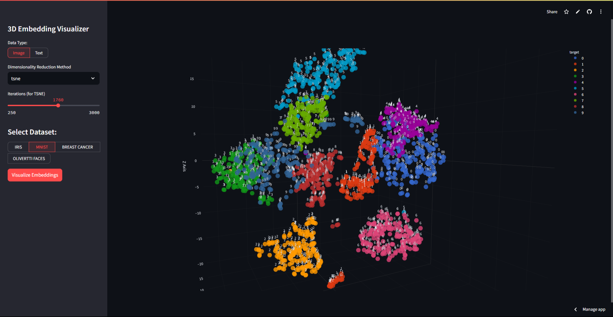

# 3D Embedding Visualizer

**3D Embedding Visualizer** is a Python Streamlit-based application for visualizing high-dimensional image and text embeddings in 3D using PCA, UMAP, and T-SNE. It provides an interactive interface to explore and understand embeddings from popular datasets and custom text.

This helps to quickly visualize and explore the structure of image and text embeddings in 3D, making it easier to understand relationships and patterns in your data. And also to compare various dimensionality reduction techniques, with each other.

---

## Features

- Visualize embeddings for both images (Iris, MNIST, Breast Cancer, Olivetti Faces) and custom text
- Choose between PCA, UMAP, and T-SNE for dimensionality reduction
- Interactive 3D scatter plots with Plotly
- Easy-to-use Streamlit interface

---

<!-- Screenshot -->


---

## 📦 Installation & Usage

### 1. Clone the Repository

```bash
git clone https://github.com/nihar371/3D-Embedding-Visualizer.git
cd 3D-Embedding-Visualizer
```

### 2. Set Up the Environment

It is recommended to use a virtual environment:

```bash
# On Windows
python -m venv venv
venv\Scripts\activate

# On macOS/Linux
python3 -m venv venv
source venv/bin/activate
```

### 3. Install All Dependencies

All required Python packages can be installed using the provided `requirements.txt` file:

```bash
pip install -r requirements.txt
```

This will install all necessary libraries, including NLTK, spaCy, and the spaCy English model.

### 4. Run the App

```bash
streamlit run streamlit_app.py
```

The app will open in your browser at [http://localhost:8501](http://localhost:8501).

---

## 🛠️ Issues & Contributions

If you encounter any issues or have suggestions for improvements:

1. [Open an issue](https://github.com/nihar371/3D-Embedding-Visualizer/issues) with a clear description.
2. Include error messages, screenshots, and steps to reproduce if possible.
3. Pull requests are welcome! Please fork the repo and submit a PR.
